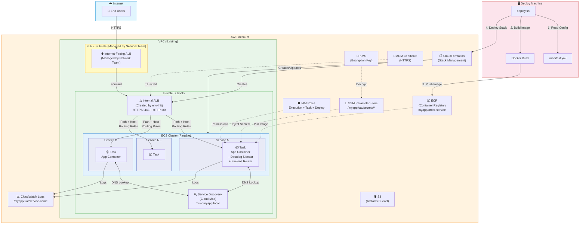
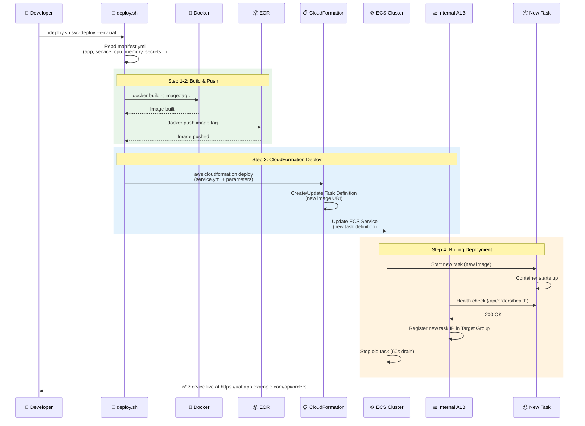
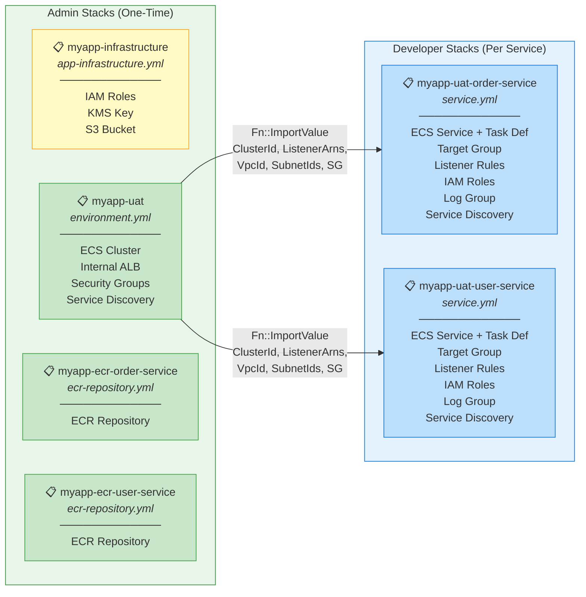
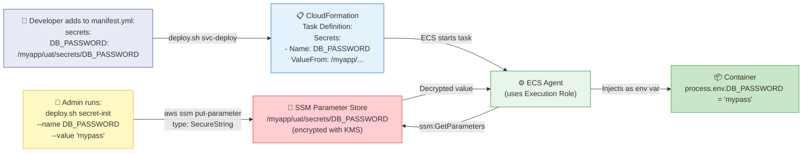

# ECS Deploy - AWS Copilot Replacement

A simplified ECS deployment framework using reusable CloudFormation templates and a bash deploy script.

## AWS Architecture Diagram



## Deployment Flow



## CloudFormation Stack Dependency



## Secrets Flow



---

## Folder Structure

```
ecs-deploy/
├── templates/
│   ├── app-infrastructure.yml   # Admin: IAM roles, KMS, S3
│   ├── ecr-repository.yml       # Admin: ECR repo per service
│   ├── environment.yml          # Admin: ECS cluster, ALB, SGs
│   └── service.yml              # Dev: ECS service, task def, TG, listener rules
├── scripts/
│   └── deploy.sh                # CLI wrapper
├── config/
│   └── manifest.yml             # Example manifest (developers copy this)
├── CODE_EXPLANATION.md          # Detailed code explanation of every file
└── README.md
```

## Admin Commands (one-time)

```bash
# 1. Initialize app infrastructure
./deploy.sh app-init --app myapp --department IT

# 2. Create environment
./deploy.sh env-init --app myapp --env uat --department IT \
  --vpc-id vpc-0abc123def456789 \
  --private-subnets subnet-0abc123,subnet-0def456 \
  --cert-arn arn:aws:acm:ap-south-1:123456789012:certificate/abcd-1234-efgh-5678

# 3. Create ECR repo for a service
./deploy.sh add-repo --app myapp --service order-service --department IT
```

## Developer Commands

```bash
# Deploy a new service or update existing (reads manifest.yml by default)
./deploy.sh svc-deploy --env uat

# Deploy with explicit config path
./deploy.sh svc-deploy --config manifest.yml --env uat

# Deploy with a specific image tag
./deploy.sh svc-deploy --env uat --tag v1.2.3

# Store a secret
./deploy.sh secret-init --app myapp --env uat --name DB_PASSWORD --value "mypassword" --department IT
```

## Service Manifest (manifest.yml)

Developers create this file in their project root. See `config/manifest.yml` for a full example.

```yaml
app: myapp
service: order-service
department: IT
port: 3000
path: /api/orders
healthcheck: /api/orders/health
dockerfile: Dockerfile
listener_rule_priority: 10

environments:
  uat:
    alias: uat.app.example.com
    cpu: 2048
    memory: 4096
    count: 1
    deployment: recreate
    variables:
      AWS_REGION: ap-south-1
    secrets:
      DB_PASSWORD: /myapp/uat/secrets/DB_PASSWORD
```

## SSM Secrets Path Convention

```
/{app}/{env}/secrets/{SECRET_NAME}
```

Example: `/myapp/uat/secrets/DB_PASSWORD`

## Tags

All resources are tagged with:
- `app` - Application name
- `environment` - Environment name (where applicable)
- `service` - Service name (where applicable)
- `Department` - Department name (e.g., IT)

## Prerequisites

- AWS CLI v2 configured with appropriate credentials
- Docker installed and running
- Bash shell (Linux/macOS/WSL)
- Existing VPC with private subnets
- ACM certificate for HTTPS

## Detailed Code Explanation

See [CODE_EXPLANATION.md](CODE_EXPLANATION.md) for a comprehensive breakdown of every file,
every resource, and the logic behind how each component works.
